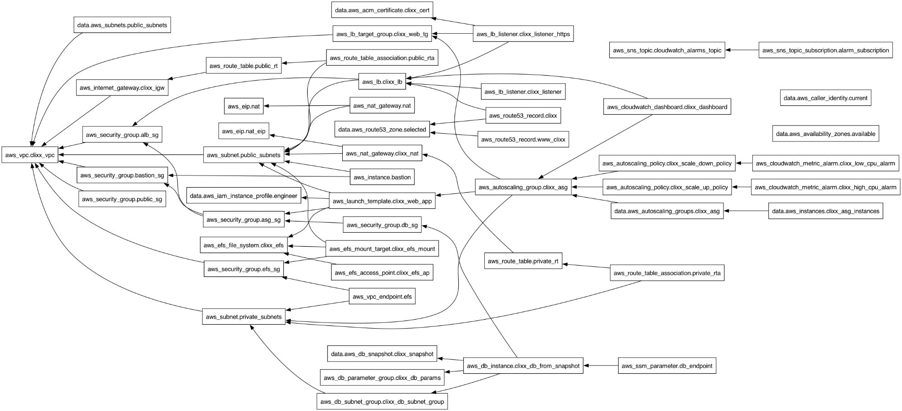

# CliXX Retail — AWS Infrastructure as Code

Production-grade Terraform configuration for deploying a multi-tier web application on AWS. Includes VPC networking, auto-scaled compute, managed database, shared storage, HTTPS load balancing, monitoring, and a CI/CD pipeline with Jenkins.

## Architecture



### Components

- **VPC** with public and private subnets across 2 AZs, purpose-segmented (web, app, database, microservices)
- **Application Load Balancer** with HTTP→HTTPS redirect and ACM certificate
- **Auto Scaling Group** with launch template, CPU-based scaling policies, and CloudWatch alarms
- **RDS MySQL** restored from snapshot, deployed in private subnets with parameter group tuning
- **EFS** encrypted shared filesystem with mount targets and access points
- **Bastion Hosts** (x2) for SSH access to private instances
- **NAT Gateways** (x2) for HA outbound connectivity from private subnets
- **Route 53** DNS with alias records pointing to the ALB
- **CloudWatch** dashboard, CPU alarms, and SNS email notifications
- **VPC Endpoints** for EFS private connectivity
- **Jenkins CI/CD** pipeline with Slack notifications, manual approval gates, and destroy safeguards

### Network Layout

```
VPC: 10.0.0.0/16

Public Subnets (Web Tier):
  10.0.0.0/23  — AZ-A (512 hosts)
  10.0.2.0/23  — AZ-B (512 hosts)

Private Subnets:
  10.0.4.0/24  — App Tier 1, AZ-A
  10.0.5.0/24  — App Tier 1, AZ-B
  10.0.6.0/24  — App Tier 2, AZ-A
  10.0.7.0/24  — App Tier 2, AZ-B
  10.0.8.0/24  — RDS, AZ-A
  10.0.9.0/24  — RDS, AZ-B
  10.0.10.0/24 — Oracle, AZ-A
  10.0.11.0/24 — Oracle, AZ-B
  10.0.12.0/26 — Java/Microservices, AZ-A
  10.0.12.64/26— Java/Microservices, AZ-B
```

### Security Group Chain

```
Internet → ALB SG (80, 443)
             ↓
           ASG SG (80, 443 from ALB | 22 from Bastion)
             ↓
           DB SG  (3306 from ASG)
           EFS SG (2049 from private subnets)
```

## Prerequisites

- Terraform >= 1.3.0
- AWS CLI configured with appropriate credentials
- An IAM role with permissions to create VPC, EC2, RDS, EFS, Route 53, CloudWatch, and SSM resources
- A Route 53 hosted zone for your domain
- An ACM certificate (wildcard) for your domain
- An RDS snapshot to restore from
- An SSH key pair in your target AWS region
- SSM parameters for AMI lookup (or provide an AMI ID directly)

## Quick Start

```bash
# Clone the repository
git clone https://github.com/Kwamib/aws-multi-tier-infra.git
cd aws-multi-tier-infra

# Create your variable file from the example
cp terraform.tfvars.example terraform.tfvars
# Edit terraform.tfvars with your values

# Initialize Terraform
terraform init

# Review the plan
terraform plan

# Apply
terraform apply
```

## Project Structure

```
.
├── alb.tf                    # Application Load Balancer, listeners, target group
├── asg.tf                    # Auto Scaling Group and scaling policies
├── backend.tf                # S3 remote state backend configuration
├── cloudwatch.tf             # Alarms, SNS topic, monitoring dashboard
├── data.tf                   # Data sources (AMI, ACM, snapshots, SSM)
├── database.tf               # RDS instance, parameter group, subnet group
├── efs.tf                    # EFS file system and mount targets
├── internet_gateway.tf       # Internet gateway
├── jumpbox.tf                # Bastion hosts (HA, one per AZ)
├── launch_template.tf        # EC2 launch template with user data
├── locals.tf                 # Local variables and computed values
├── nat_gateway.tf            # NAT gateways and Elastic IPs
├── outputs.tf                # Stack outputs
├── provider.tf               # AWS provider configuration
├── route53.tf                # DNS records
├── route_tables.tf           # Public and private route tables
├── security_groups.tf        # All security groups
├── subnets.tf                # Public and private subnets
├── userdata.sh               # EC2 bootstrap script (EFS mount, DB config)
├── vars.tf                   # Input variable definitions
├── versions.tf               # Terraform and provider version constraints
├── vpc.tf                    # VPC resource
├── vpc_endpoints.tf          # VPC endpoint for EFS, access point
├── Jenkinsfile               # CI/CD pipeline (init, plan, approve, apply, destroy)
├── terraform.tfvars.example  # Example variable values
├── .gitignore
├── images/
│   └── image_pkr.hcl         # Packer template for golden AMI builds
├── scripts/
│   └── setup.sh              # Base image provisioning script
└── docs/
    └── architecture-graph.png # Terraform dependency graph
```

## CI/CD Pipeline

The included `Jenkinsfile` implements a deployment pipeline with:

1. **Terraform Init** — with automatic state migration and reconfigure fallback
2. **Terraform Plan** — generates and saves an execution plan
3. **Manual Approval** — requires human confirmation before apply
4. **Terraform Apply** — applies the saved plan
5. **Post-Deployment** — option to keep infrastructure or destroy with double confirmation

Slack notifications are sent at every stage for visibility.

### AMI Pipeline

A separate Packer pipeline (`images/image_pkr.hcl`) builds golden AMIs with the application pre-installed. AMI IDs are published to SSM Parameter Store for consumption by the launch template.

## Key Design Decisions

- **Purpose-based subnet naming** — subnets are tagged by function (web, app, rds, oracle, java) for clear organizational mapping
- **HA NAT Gateways** — one per AZ to avoid cross-AZ data transfer costs and single points of failure
- **Cross-account AMI management** — AMIs are built in an automation account and shared via SSM parameters
- **EFS for shared storage** — WordPress content is stored on EFS so ASG instances share the same filesystem
- **RDS from snapshot** — database is restored from a production snapshot for consistent deployments
- **Destroy safeguards** — Jenkins pipeline requires typing "DESTROY" and checking a confirmation box

## Variables Reference

See `terraform.tfvars.example` for all configurable values. Required variables:

| Variable | Description |
|---|---|
| `assume_role_arn` | IAM role ARN for provisioning |
| `domain_name` | Base domain (must have Route 53 hosted zone) |
| `key_name` | EC2 SSH key pair name |
| `snapshot_identifier` | RDS snapshot ID to restore from |
| `alarm_email` | Email for CloudWatch notifications |
| `owner_email` | Owner email for resource tagging |

## License

MIT
